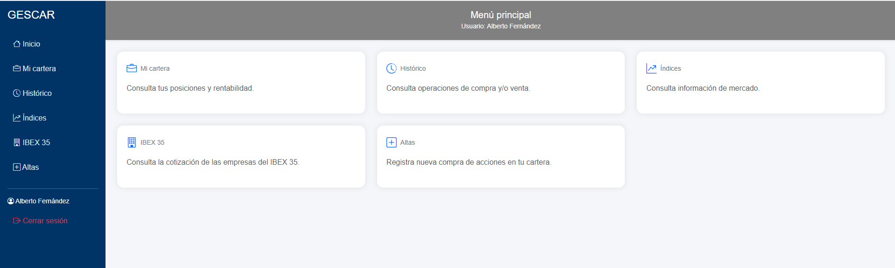

# GESCAR

Sistema de gestión de carteras de inversión desarrollado como Trabajo Fin de Grado.

<p align="center">
    
</p>

**GESCAR** (Gestor de Carteras de Inversión) es una aplicación web desarrollada en **Python** utilizando el framework **Flask**, cuyo objetivo es permitir la gestión de una cartera de inversión de forma sencilla e intuitiva.

La aplicación permite registrar operaciones de compra y venta de acciones, consultar la composición de la cartera, obtener cotizaciones actualizadas mediante Yahoo Finance y exportar la información a Excel y PDF.

---

# Características principales

- Autenticación de usuarios mediante inicio de sesión.
- Gestión de carteras de inversión.
- Registro de compras de acciones.
- Registro de ventas de acciones.
- Cálculo automático de posiciones abiertas.
- Consulta del histórico de operaciones.
- Consulta de índices bursátiles.
- Consulta de las empresas del IBEX 35.
- Actualización automática de cotizaciones mediante Yahoo Finance.
- Exportación de información a Excel.
- Exportación de información a PDF.
- Interfaz responsive desarrollada con Bootstrap.
- Tablas dinámicas mediante DataTables.

---

# Tecnologías utilizadas

## Backend

- Python 3.x
- Flask
- PyMySQL
- Werkzeug
- yfinance

## Frontend

- HTML5
- CSS3
- Bootstrap 5
- JavaScript
- DataTables

## Base de datos

- MySQL
- XAMPP

## Librerías utilizadas

- openpyxl
- reportlab
- python-dotenv
- pandas
- yfinance

---

# Arquitectura

El proyecto sigue una arquitectura por capas.

```
Cliente (Navegador)
        │
        ▼
      Flask
        │
 ┌───────────────┐
 │    Routes     │
 └───────────────┘
        │
        ▼
 ┌───────────────┐
 │   Services    │
 └───────────────┘
        │
        ▼
 ┌───────────────┐
 │    Models     │
 └───────────────┘
        │
        ▼
      MySQL

        ▲
        │
  Clases de dominio
      (Domain)
```

---

# Estructura del proyecto

```
GESCAR/
│
├── app.py
├── config.py
├── requirements.txt
├── .env
│
├── database/
│
├── domain/
│   ├── cartera.py
│   ├── operacion.py
│   ├── posicion.py
│   └── valor.py
│
├── models/
│
├── routes/
│
├── services/
│
├── static/
│   ├── css/
│   ├── img/
│   └── js/
│
├── templates/
│
└── utils/
```

---

# Requisitos

Antes de ejecutar la aplicación es necesario disponer de:

- Python 3.11 o superior
- MySQL
- XAMPP
- Git (opcional)

---

# Instalación

## 1. Clonar el proyecto

```bash
git clone https://github.com/usuario/gescar.git
```

o descargar el proyecto en formato ZIP.

---

## 2. Crear un entorno virtual

Windows

```bash
python -m venv venv
```

Activarlo

```bash
venv\Scripts\activate
```

---

## 3. Instalar las dependencias

```bash
pip install -r requirements.txt
```

---

## 4. Crear la base de datos

Desde phpMyAdmin crear la base de datos:

```
gescar_db
```

Importar posteriormente el archivo:

```
schema.sql
```

---

## 5. Configurar el archivo .env

Crear un archivo llamado:

```
.env
```

con el siguiente contenido:

```env
SECRET_KEY=gescar_clave_desarrollo

DB_HOST=localhost
DB_PORT=3306
DB_USER=root
DB_PASSWORD=
DB_NAME=gescar_db

FLASK_DEBUG=True
```

---

# Ejecución

Con el entorno virtual activado:

```bash
python app.py
```

Abrir posteriormente el navegador:

```
http://localhost:5000
```

---

# Funcionalidades

## Inicio de sesión

Permite acceder a la aplicación mediante usuario y contraseña.

---

## Mi cartera

Muestra:

- Valor de la cartera
- Inversión realizada
- Rentabilidad
- Posiciones abiertas

---

## Altas

Permite registrar nuevas compras de acciones.

Las acciones disponibles corresponden a todas las empresas del IBEX 35.

---

## Venta de acciones

Permite vender parcial o totalmente una posición existente.

La aplicación actualiza automáticamente la cartera.

---

## Histórico

Consulta de todas las compras y ventas realizadas.

Incluye filtros y ordenación mediante DataTables.

---

## Índices

Consulta de los principales índices bursátiles.

Actualización automática de cotizaciones.

---

## IBEX 35

Consulta de todas las empresas del IBEX 35.

Actualización automática desde Yahoo Finance.

---

## Exportaciones

La información puede exportarse a:

- Excel (.xlsx)
- PDF

---

# Seguridad

La aplicación incorpora:

- Contraseñas cifradas mediante Werkzeug.
- Gestión de sesiones.
- Protección de rutas mediante login_required.
- Configuración centralizada mediante variables de entorno.

---

# Autor

Trabajo Fin de Grado

Desarrollado por:

**Alberto Fernández**

Grado Superior en Desarrollo de Aplicaciones Multiplataforma (DAM)

Curso 2025-2026

---

# Licencia

Este proyecto ha sido desarrollado con fines exclusivamente académicos como Trabajo Fin de Grado.